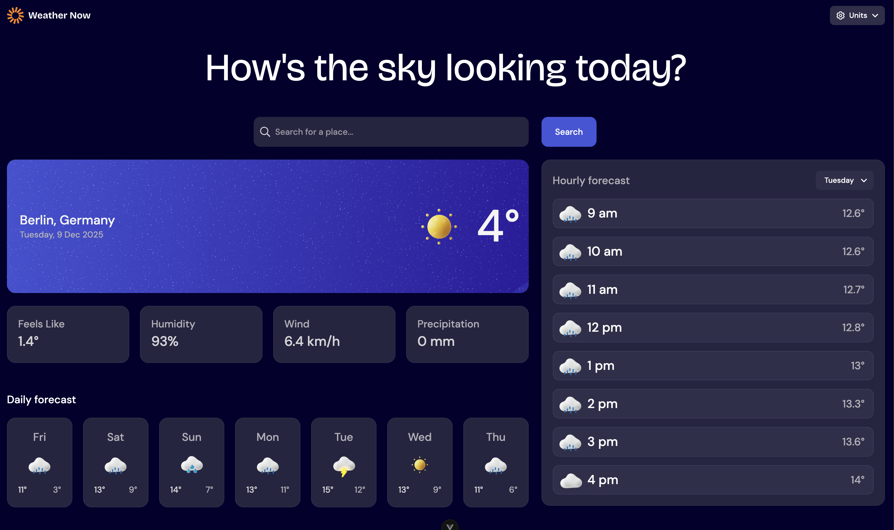
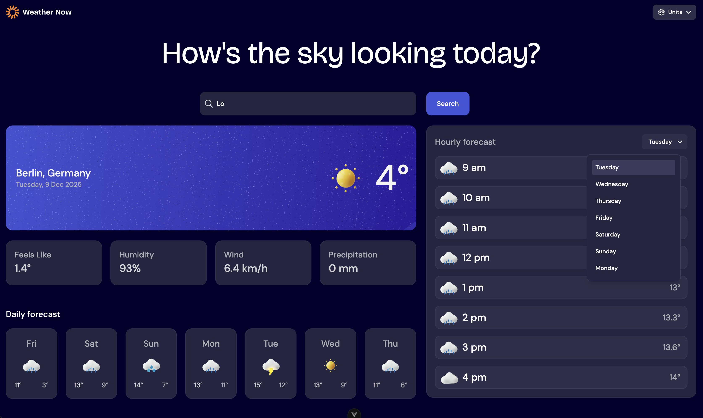
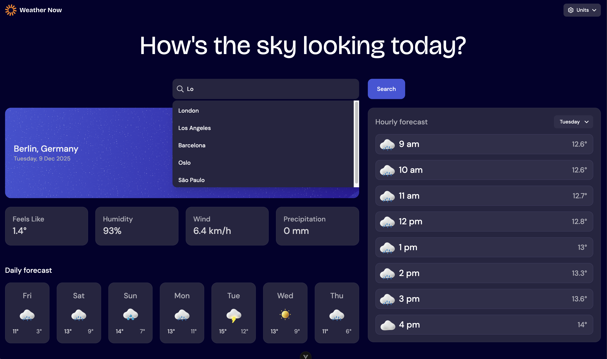
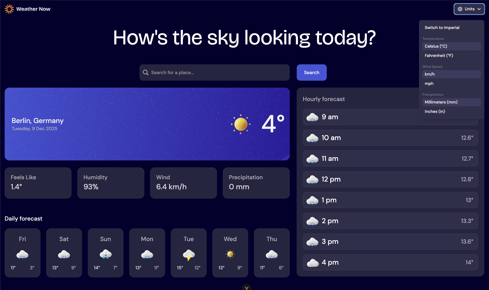
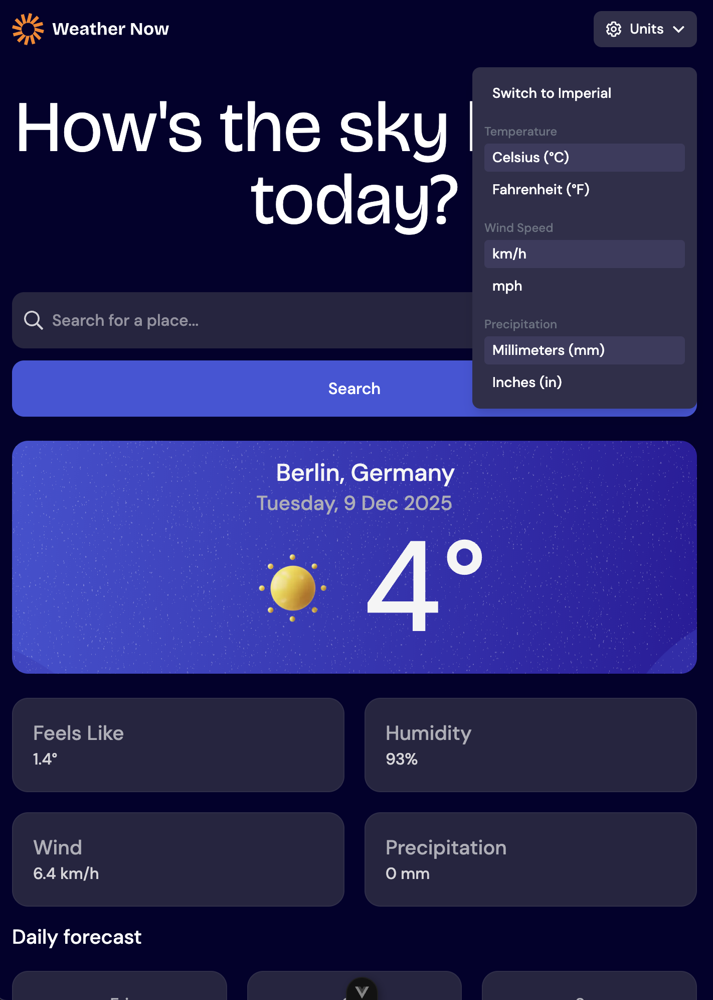
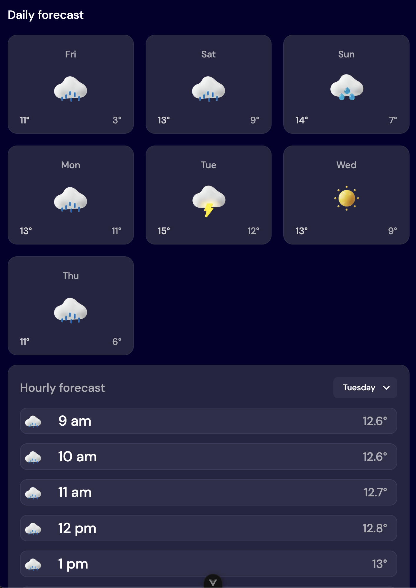
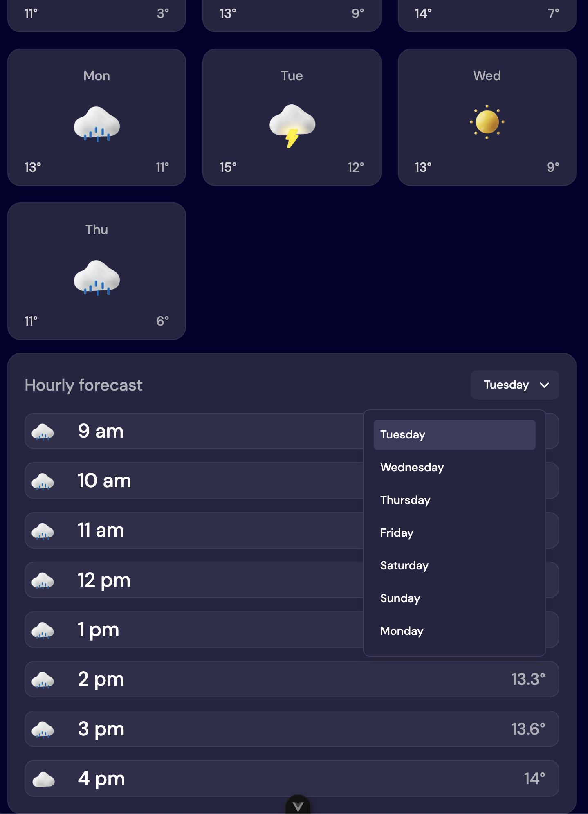

# Frontend Mentor - Weather App

🌦️ **Weather Forecast App**

A responsive weather application built for the [Frontend Mentor](https://www.frontendmentor.io) coding challenge with **Vue**, **Open-Meteo API**, and modern UI styling.  
Users can search for any city and instantly view real-time weather information, hourly forecasts, and a 7-day outlook.

### Screenshots

  
  
  
  

  


## 🚀 Features

### 🔍 Search

- Enter a city name to fetch live weather data
- Smart geocoding helps match locations accurately

---

### ☀️ Current Weather

Displays:

- Temperature
- Location (city + country)
- Weather icon
- "Feels like" temperature
- Humidity percentage
- Wind speed
- Precipitation amounts

---

### 📅 7-Day Forecast

- Daily high and low temperatures
- Weather icons for each day

---

### ⏰ Hourly Forecast

- Shows temperature changes throughout the day
- Day selector for switching between days
- Smooth, responsive layout for all screen sizes

---

### 🔁 Unit Switching

- Toggle between **Metric** and **Imperial**
- All values update instantly

---

### 📱 Responsive UI

- Fully optimized for **mobile**, **tablet**, and **desktop**
- Layout adapts automatically

---

### ✨ Accessible Interactions

- Hover states on all interactive elements
- Clear focus styles for keyboard navigation

---

## 🛠️ Technologies Used

- **Vue 3 (Composition API)**
- **TypeScript**
- **Tailwind CSS**
- **Open-Meteo Weather & Geocoding APIs**
- **Vite**
- **Vitest / Playwright**

---

## 📦 Installation

```bash
# Clone repo
git clone <your-repo-url>
cd <project-folder>

# Install dependencies
npm install

# Start dev server
npm run dev
```
